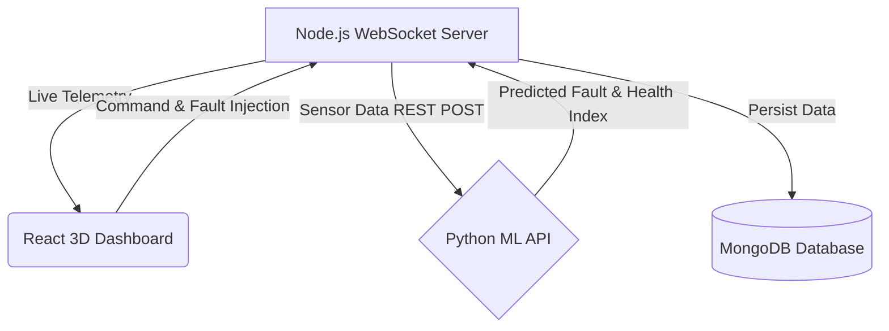

# Aerospace Digital Twin & Degradation Predictive System
## Comprehensive Project Documentation

This document serves as a complete overview of the Aerospace Digital Twin system we have built. It explains the architecture, the technology stack, how the different components communicate, and how to operate the system.

> [!NOTE]
> **Project Goal**
> The goal of this system is to predict and visualize drone degradation and hardware faults in real-time. It uses historical flight logs to train a deep learning model, and replays that data through a highly realistic 3D command center to simulate live drone operations.

---

## 1. System Architecture

The project is built using a modern **Microservices Architecture** divided into three main components that communicate in real-time.

### 1. Python Machine Learning API (Port 5001)
- **Role:** The brain of the predictive system. It hosts the trained Deep Learning model.
- **How it works:** The Node.js server sends a batch of 13 sensor readings (like Pitch, Roll, GPS, Motor RPM, Vibrations). The Python API runs this through the neural network and returns the predicted `fault_class` and a calculated `health_index` (Remaining Useful Life).

### 2. Node.js Telemetry Backend (Port 5000)
- **Role:** The traffic controller and simulation engine.
- **How it works:** It reads the CSV dataset files and "replays" them line-by-line to simulate live telemetry. It mathematically synthesizes spatial GPS coordinates into a local X/Z grid, manages the 5 drones in the swarm, and broadcasts the data to the frontend via WebSockets at 10 times a second (10Hz).

### 3. React Frontend Dashboard (Port 5173)
- **Role:** The Command Center UI.
- **How it works:** It listens to the WebSocket stream and dynamically updates real-time charts (Recharts), the 2D GPS Map, and the realistic 3D WebGL environment (`@react-three/fiber`). 

---

## 2. Technology Stack & Tools Used

### Artificial Intelligence / Machine Learning
* **Python 3**: The core language for the data science pipeline.
* **TensorFlow / Keras**: Used to build a **Bi-Directional GRU (Gated Recurrent Unit) with Multi-Head Attention**. This allows the model to analyze time-series sensor data and focus on the specific sensors causing a fault.
* **Scikit-Learn**: Used for data scaling (`StandardScaler`), SMOTE (handling imbalanced data), and generating classification metrics (Confusion Matrix).
* **Pandas & NumPy**: For parsing the massive CSV datasets.

### Backend Infrastructure
* **Node.js & Express**: A lightweight server to handle API routing and file streaming.
* **Socket.io**: Used for ultra-low latency, bi-directional communication between the server and the browser dashboard.
* **MongoDB & Mongoose**: Used as a NoSQL database to persistently log the telemetry and AI predictions for historical review.

### Frontend Visualization
* **React.js (Vite)**: The core UI framework, built with Vite for extremely fast hot-reloading.
* **TailwindCSS**: Used for rapid, modern, and dark-mode styling (glassmorphism panels, glowing borders).
* **Three.js & React Three Fiber**: The WebGL 3D engine used to render the realistic drone models, the procedural low-poly city, lighting, shadows, and fog.
* **Recharts**: A React charting library used for the live Degradation and Remaining Useful Life (RUL) trend lines.
* **Web Audio API**: Used to synthesize the emergency klaxon warning alarms.

---

## 3. Key Features We Implemented

### 🧠 The Predictive Model
We successfully trained an AI to detect 5 distinct states with **99.73% accuracy**:
1. `Nominal` (Healthy)
2. `Vibration Fault`
3. `Sensor Drift`
4. `GPS Fault`
5. `Battery Fault`

### 🎮 The 3D Digital Twin
The 3D canvas isn't just an animation; it is a **true digital twin** driven by real mathematical data.
- **Dynamic Camera:** Automatically tracks the selected drone, keeping it perfectly centered at a 15-meter altitude.
- **Procedural Environment:** Generates a randomized low-poly city underneath the drones to provide a massive sense of scale and speed via parallax.
- **Physics Reactions:** If a fault is detected (e.g., Health < 80%), the drone will physically drop in altitude and wobble violently.
- **Visual & Audio Alarms:** Drones emit pulsing strobe lights based on the fault type (Red, Yellow, Purple), and the browser triggers a synthesized siren alarm.

### 🕹️ Command Injection
You can actively interact with the simulation. By using the Command Console, you can instantly inject a physical fault into any specific drone (e.g., UAV-BETA-02 -> Sensor Drift). The Node server will spoof the sensor data, the Python API will instantly detect it, and the 3D model will react.

---

## 4. Codebase Navigation

If you ever need to modify the code, here are the most important files:

* `train_model.py`: Run this to retrain the AI on new datasets. It generates the `model.keras` and `scaler.pkl` files.
* `ml_api.py`: The Flask server that loads the model and exposes the `/predict` endpoint.
* `server.js`: The Node backend. Modify this if you want to change how fast the simulation runs, or how the spatial GPS math is calculated.
* `frontend/src/App.jsx`: The main layout of the dashboard. It holds the global state, the WebSockets connection, and the UI grid layout.
* `frontend/src/DroneModel.jsx`: The entire 3D WebGL scene. This is where you edit the lighting, the procedural city, and the drone mesh physics.

> [!TIP]
> **Running the Project**
> You can launch the entire ecosystem with a single click using the `start_system.bat` file in the root directory. This batch script automatically boots up MongoDB, the Python API, the Node Backend, and the React Frontend in parallel.
